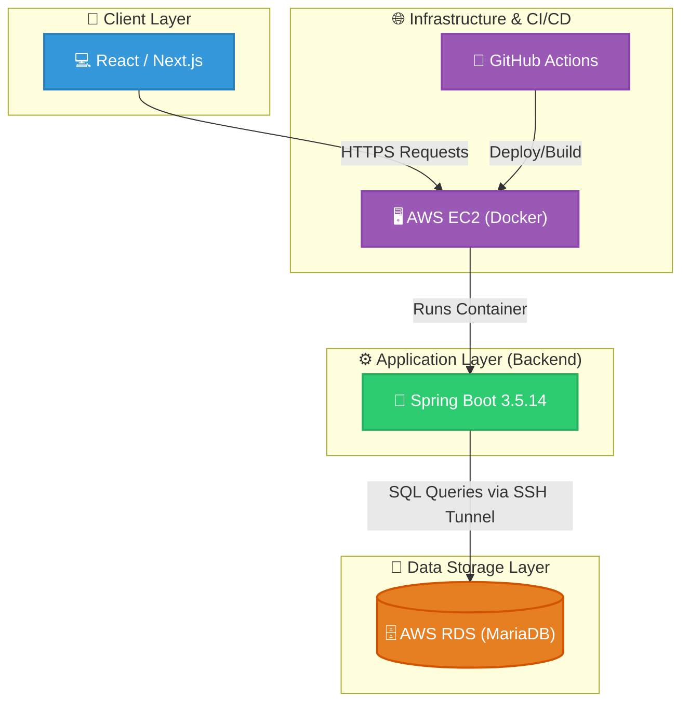

# CrowdFund 프로젝트
2026.05.08 ~ 2026.06.15(1차 개발 완료) - AWS 비용 청구 이슈로 인해 현재 배포 중단 중

>  [API SwaggerLink](http://3.34.181.49/swagger-ui/index.html#)

## 💡 주요 기능 및 유저 플로우 (추후 데모 영상 추가 예정)

용어 설명:
- **프로젝트**: 창작자가 자신의 창작물을 공개하는 공간
- **리워드**: 후원자들이 자금을 지원한 대가로 받게 되는 보상

### 1. 회원 인증 및 사용자 관리
- **회원가입/로그인**: JWT(JSON Web Token) 기반의 인증 시스템을 통해 안전한 회원가입 및 로그인 처리를 수행합니다.
- **마이페이지**: 사용자는 개인 정보를 조회/수정 및 삭제(회원 탈퇴)할 수 있습니다.
- **내 후원 내역**: 사용자는 자신의 후원 내역을 **복합 커서 기반 최신순 페이지네이션**과 **상태 필터(후원 이행, 후원 상태)**를 사용하여 조회할 수 있습니다.
- **내 배송지 관리**: 사용자는 자신의 배송지 정보를 조회/수정 및 삭제할 수 있습니다.
- **내 프로젝트 내역**: 사용자는 자신의 프로젝트 내역을 조회/수정 및 삭제할 수 있습니다.

### 2. 프로젝트 관리 (창작자)
프로젝트는 생성한 본인만 관리할 수 있습니다. 프로젝트를 생성한 사용자를 창작자로 부릅니다.

- **프로젝트 생성**: 사용자는 특정 카테고리에 속한 프로젝트를 생성하여 창작자가 될 수 있습니다.
- **프로젝트 관리**: 창작자는 본인의 프로젝트 정보를 수정하거나 삭제할 수 있습니다.  
- **리워드 생성**: 창작자는 본인의 프로젝트에 리워드를 생성할 수 있습니다.
- **리워드 관리**: 창작자는 본인의 프로젝트에 생성된 리워드를 수정하거나 삭제할 수 있습니다.

### 3. 프로젝트 후원 및 커뮤니티
- **프로젝트 조회**: 모든 사용자는 **복합 커서 기반 최신순 페이지네이션**과 **카테고리/상태 필터**를 통해 프로젝트를 탐색하고 상세 정보를 조회할 수 있습니다.
- **후원하기**: 사용자는 프로젝트의 리워드를 선택하고 후원 및 결제를 진행합니다.
- **후원 및 배송지 관리**: 후원자는 자신의 후원 내역을 조회하고 리워드를 배송받을 배송지를 수정할 수 있습니다.
- **댓글 기능**: 프로젝트 상세 페이지에서 후원자들은 프로젝트에 대한 댓글을 남길 수 있습니다.
- **내 댓글 관리**: 사용자는 자신이 작성한 댓글을 **커서 기반 최신순 페이지네이션**을 통해 조회하며, 수정 및 삭제할 수 있습니다.

### 4. 리워드 및 결제
- **리워드 관리**: 창작자는 프로젝트에 맞는 리워드를 생성하고 관리합니다.
- **결제 내역 조회**: 후원자는 마이페이지에서 결제 내역을 조회할 수 있습니다.

### 5. 관리자 기능
- **카테고리 관리**: 관리자는 시스템 전반에서 사용되는 프로젝트 카테고리를 생성하고 관리합니다.
- **후원 관리**: 관리자는 **복합 커서 기반 최신순 페이지네이션**과 **상태 필터(후원 이행, 후원 상태)**를 통해 전체 후원 내역을 조회하고 상세 정보를 확인할 수 있습니다.

## 시스템 아키텍처(System Architecture)

## 🚀 CD 및 배포 방식

CD 구현 방식: GitHub Actions과 Docker Hub Repository 사용

- **배포 프로세스**: `master` 브랜치로의 Pull Request가 `merged` 되는 시점에 GitHub Actions가 자동으로 실행됩니다.
  1. 소스 코드 체크아웃 및 Java 17 환경 설정
  2. Docker 이미지 빌드 및 Docker Hub 푸시
  3. Amazon EC2 원격 접속 (SSH)
  4. 기존 컨테이너 중지/삭제 및 최신 이미지 Pull 후 컨테이너 실행

## 📂 패키지 구조

- `io.github.crowdfund.global`: 전역 설정 (Security, 전역 예외 핸들러, 공통 응답 DTO, 페이지네이션 등)
- `io.github.crowdfund.domain`: Spring Data JDBC를 위한 도메인 엔티티와 도메인 인터페이스, 그리고 MyBatis를 위한 도메인 매퍼
- `io.github.crowdfund.feature`: 각 기능별 서비스 로직 및 API 컨트롤러 (auth, project, reward, payment 등)

## ERD

