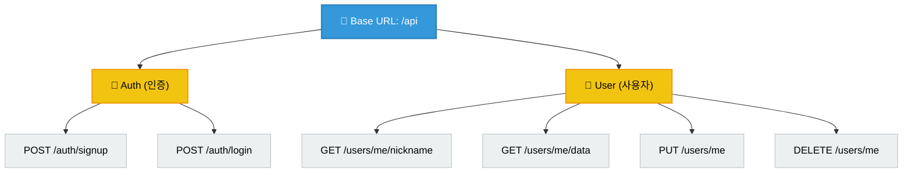
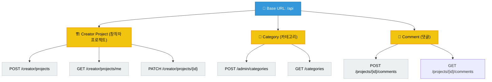
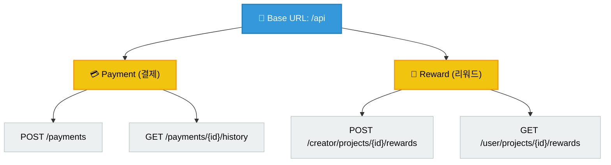
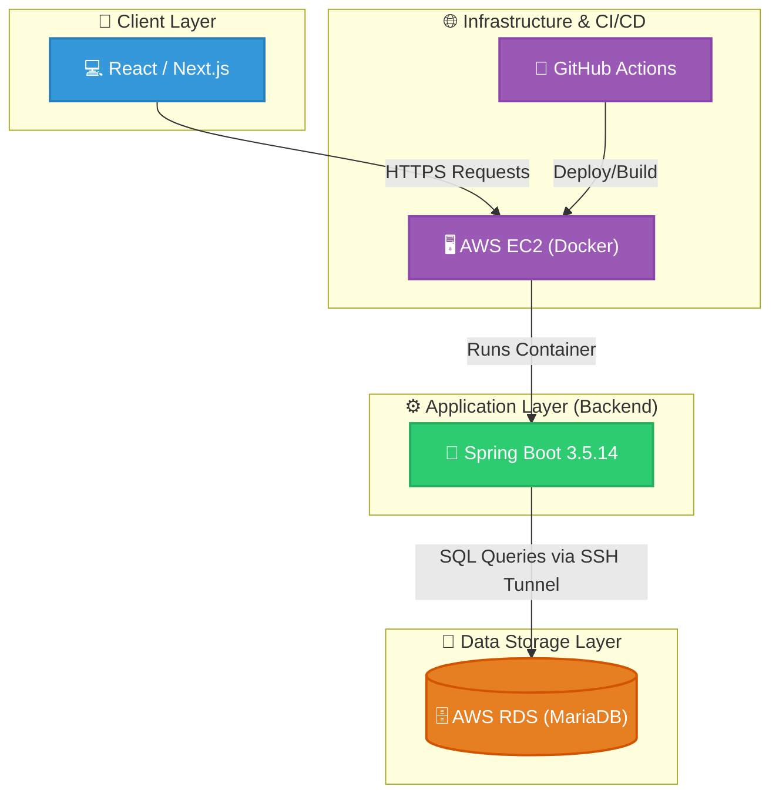

# CrowdFund

## 🌐 API Overall Architecture

> 💡 실제 API 테스트 및 상세 명세는 오른쪽 위 링크의 Swagger UI에서 확인할 수 있습니다.

### 🗺️ API Endpoint Map
전체 API 구조를 한눈에 볼 수 있는 도메인별 지도입니다.

#### 1. 인증 및 사용자

##### 📋 상세 API 목록
- **Auth (인증)**
  - `POST /api/auth/login`: 로그인
  - `POST /api/auth/signup`: 회원가입
- **User (사용자)**
  - `PUT /api/users/me`: 내 정보 수정
  - `DELETE /api/users/me`: 회원 탈퇴
  - `GET /api/users/me/data`: 내 정보 조회
  - `GET /api/users/me/nickname`: 내 닉네임 조회
- **UserAddress (배송지)**
  - `POST /api/users/me/address`: 내 배송지 등록
  - `DELETE /api/users/me/address/{addressId}`: 내 배송지 삭제
  - `PATCH /api/users/me/address/{addressId}`: 내 배송지 수정
  - `PATCH /api/users/me/address/{addressId}/default`: 기본 배송지 변경
  - `GET /api/users/me/addresses`: 내 배송지 목록 조회

#### 2. 프로젝트, 카테고리 및 댓글

##### 📋 상세 API 목록
- **Category (카테고리)**
  - `POST /api/admin/categories`: 카테고리 생성 (Admin)
  - `DELETE /api/admin/categories/{categoryId}`: 카테고리 삭제 (Admin)
  - `PATCH /api/admin/categories/{categoryId}/parent`: 카테고리 부모 변경 (Admin)
  - `PATCH /api/admin/categories/{categoryId}/rename`: 카테고리 이름 변경 (Admin)
  - `PATCH /api/admin/categories/{categoryId}/toggle`: 카테고리 활성 여부 변경 (Admin)
  - `PATCH /api/admin/categories/sort-order`: 카테고리 정렬 순서 변경 (Admin)
  - `GET /api/categories`: 카테고리 트리 조회
- **Project (프로젝트)**
  - `POST /api/creator/projects`: 프로젝트 생성 (Creator)
  - `DELETE /api/creator/projects/{projectId}`: 프로젝트 삭제 (Creator)
  - `PATCH /api/creator/projects/{projectId}`: 프로젝트 제목/본문 수정 (Creator)
  - `PATCH /api/creator/projects/{projectId}/cancel`: 프로젝트 취소 (Creator)
  - `GET /api/creator/projects/{projectId}/shipping-infos`: 후원자들의 배송지 목록 조회 (Creator)
  - `GET /api/creator/projects/me`: 내 프로젝트 조회 (Creator)
  - `GET /api/projects`: 프로젝트 목록 조회
  - `GET /api/projects/{projectId}`: 프로젝트 상세 조회
- **Comment (댓글)**
  - `GET /api/users/me/comments`: 내 댓글 목록 조회
  - `DELETE /api/users/me/comments/{commentId}`: 내 댓글 삭제
  - `PATCH /api/users/me/comments/{commentId}`: 내 댓글 수정
  - `GET /api/projects/{projectId}/comments`: 프로젝트 댓글 목록 조회
  - `POST /api/projects/{projectId}/comments`: 프로젝트 댓글 작성

#### 3. 결제 및 리워드

##### 📋 상세 API 목록
- **Reward (리워드)**
  - `POST /api/creator/projects/{projectId}/rewards`: 리워드 등록 (Creator)
  - `DELETE /api/creator/rewards/{rewardId}`: 리워드 삭제 (Creator)
  - `PATCH /api/creator/rewards/{rewardId}`: 리워드 정보 수정 (Creator)
  - `PATCH /api/creator/rewards/{rewardId}/stock`: 리워드 재고 수정 (Creator)
  - `GET /api/user/projects/{projectId}/rewards`: 리워드 목록 조회 (User)
- **Pledge (후원)**
  - `GET /api/admin/pledges`: 전체 후원 목록 조회 (Admin)
  - `GET /api/admin/pledges/{pledgeId}`: 후원 상세 조회 (Admin)
  - `PATCH /api/creator/pledges/{pledgeId}/fulfill`: 보상 이행 상태 변경 (Creator)
  - `GET /api/pledges/me`: 내가 후원한 프로젝트 목록 조회
  - `POST /api/pledges/me`: 프로젝트 후원하기
  - `GET /api/pledges/me/{pledgeId}`: 후원 상세 조회
  - `DELETE /api/pledges/me/{pledgeId}`: 후원 취소
  - `PUT /api/pledges/{pledgeId}/address`: 참여한 후원의 배송 정보 교체
- **Payment (결제)**
  - `POST /api/payments`: 결제 요청
  - `DELETE /api/payments/{paymentId}`: 결제 환불
  - `GET /api/payments/{paymentId}/history`: 결제 이력 조회
  - `GET /api/payments/pledge/{pledgeId}`: 후원별 결제 상세 조회

## 📝 프로젝트 개요
이 프로젝트는 Spring Boot와 MyBatis, MariaDB를 활용한 크라우드 펀딩 플랫폼 백엔드 시스템입니다. JWT 기반의 인증/인가 처리를 지원하며, Docker를 활용한 CI/CD 환경이 구축되어 있습니다.

## 🛠 기술 스택
- **Language**: Java 17
- **Framework**: Spring Boot 3.5.14
- **ORM/DB**: MyBatis, MariaDB
- **Security**: Spring Security, JWT (jjwt)
- **Tooling**: Gradle, Docker
- **API Documentation**: SpringDoc OpenAPI (Swagger)

## 시스템 아키텍처(System Architecture)

## 🚀 CI/CD 및 배포 방식
본 프로젝트는 효율적인 배포를 위해 GitHub Actions를 활용한 자동화된 CI/CD 파이프라인을 구축하였습니다.

- **배포 프로세스**: `master` 브랜치로의 Pull Request가 `merged` 되는 시점에 GitHub Actions가 자동으로 실행됩니다.
- **워크플로우**:
  1. 소스 코드 체크아웃 및 Java 17 환경 설정
  2. Docker 이미지 빌드 및 Docker Hub 푸시
  3. Amazon EC2 원격 접속 (SSH)
  4. 기존 컨테이너 중지/삭제 및 최신 이미지 Pull 후 컨테이너 실행
- **특징**: `Docker`를 사용하여 일관된 실행 환경을 보장하며, 환경 변수(`DB_URL`, `JWT_SECRET_KEY` 등)는 GitHub Secrets로 안전하게 관리합니다.

## 📂 프로젝트 구조
주요 패키지 구조는 다음과 같습니다:
- `io.github.crowdfund.global`: 전역 설정 (Security, Exception 등)
- `io.github.crowdfund.feature`: 각 기능별 모듈 (project, reward 등)

## 💡 주요 기능
- 회원 인증 및 JWT 기반 인가 처리
- 프로젝트 생성 및 조회 기능
- 프로젝트 리워드 관리
- 관리자(Admin) 전용 API

## ERD

