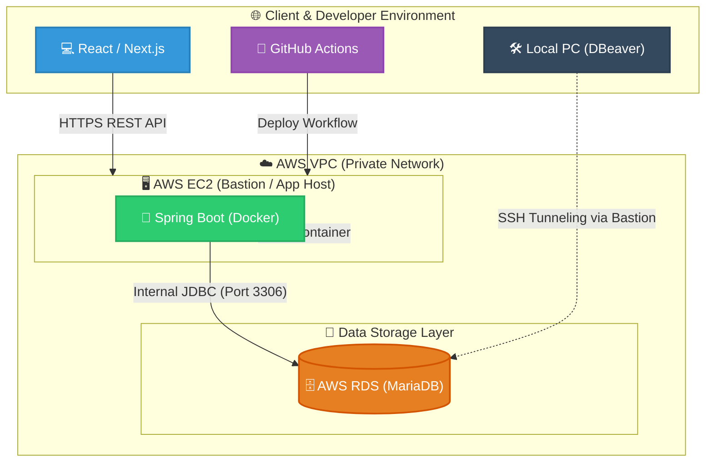

# CrowdFund - RESTful API 서버

> **복합 커서 페이징과 모듈형 아키텍처를 적용한 크라우드 펀딩 RESTful API 백엔드 시스템**  
> 대용량 데이터 조회의 성능 유지, 안전한 무상태 인증/인가 체계, 그리고 AWS 클라우드 기반의 격리 인프라 및 자동 배포 환경을 직접 설계하고 구현한 백엔드 프로젝트입니다.

<table>
  <tr>
    <td align="center" valign="top">
      <a href="https://github.com/changmin6362/CrowdFund">
        
        
<strong>CrowdFund - RESTful API 서버 주소</strong>

      </a>
    </td>
    <td align="center" valign="top">
      <a href="https://github.com/changmin6362/CrowdFundFront">
        
        
<strong>CrowdFundFront - 프론트 서버 주소</strong>

      </a>
    </td>
  </tr>
</table>

- **개발 기간**: 2026.05.08 ~ 2026.06.15 (1차 개발 완료 기간)
- **담당 역할**: 백엔드 API 설계 및 개발, DB 모델링, 클라우드 인프라(AWS) 구축 및 CI/CD 배포 자동화
- **기술 스택**:
  - **Core & Framework**: Java 17, Spring Boot 3.x, Spring Security
  - **Persistence**: Spring Data JDBC, MyBatis, MariaDB
  - **Infra & DevOps**: AWS EC2, AWS RDS, Docker, GitHub Actions
- **외부 연동 인터페이스**: 
  - RESTful API (Swagger 연동)
  - React 클라이언트 연동 (데모 UI는 상단 QR 코드로 확인 가능)

---

## 1. 백엔드 시스템 & 클라우드 인프라 아키텍처

- Data Storage Layer: AWS RDS(MariaDB) 퍼블릭 액세스를 차단하고 격리 구성. 애플리케이션은 동일 VPC 내부 사설 IP로 직접 통신하며, 로컬 개발 PC에서는 EC2를 Bastion Host로 삼아 SSH 터널링을 통해서만 안전하게 DB에 접근하도록 설계

- **Client Layer**: React SPA 기반 비동기 HTTP 요청 (CORS 보안 설정 적용)
- **Application Layer**: AWS EC2 내부 Docker 컨테이너 환경에서 Spring Boot 3.x 구동
- **Storage Layer**: AWS RDS(MariaDB) 격리 구성 (보안 그룹 기반 인바운드 제어)
- **CI/CD Pipeline**: GitHub Actions를 통한 빌드 및 SSH 기반 EC2 자동 배포 파이프라인

---

## 2. 백엔드 핵심 설계 및 구현 기술

### ① 대용량 데이터 조회를 위한 복합 커서 기반 페이지네이션
- **도입 배경**: 전통적인 `OFFSET / LIMIT` 방식은 페이지 번호가 커질수록 불필요한 누적 데이터 스캔 비용이 발생하며, 신규 데이터 삽입 시 중복 조회 문제가 발생할 수 있음.
- **구현 방식**:
  - `(created_at < :cursorCreatedAt OR (created_at = :cursorCreatedAt AND id < :cursorId))` 조건식을 활용한 인덱스 기반 $O(1)$ 연속 조회 성능 보장.
  - 별도의 카운트(COUNT) 쿼리 부하 없이 다음 데이터 존재 여부를 판별하는 **Limit + 1 전략** 채택.
  - 제네릭과 함수형 인터페이스를 활용하여 도메인별 복합 커서 주체를 외부에서 주입할 수 있도록 `CursorPaginationProcessor` 공통 모듈화.

### ② 데이터 접근 계층 이원화 (Spring Data JDBC & MyBatis 혼용)
- **도입 배경**: 단순 CRUD 작업의 개발 생산성과, 다중 조인 및 통계 처리를 위한 SQL 직접 제어력을 모두 확보하기 위해 설계.
- **구현 방식**:
  - 단순 단건 조회 및 기본 CRUD는 **Spring Data JDBC**의 메서드 이름 기반 쿼리를 활용해 코드 복잡도 최소화.
  - 후원 집계, 정산 통계, 복합 검색 등 고비용 쿼리는 **MyBatis** 매퍼를 활용해 최적화된 SQL 작성.
  - 별도의 영속성 컨텍스트 관리 없이 단일 데이터베이스 세션과 스프링 트랜잭션 범위 내에서 데이터 정합성 유지.

### ③ 무상태(Stateless) JWT 기반 인증/인가 및 2차 도메인 권한 검증
- **구현 방식**:
  - `JwtAuthenticationFilter` 커스텀 구현을 통해 토큰 유효성 검증 및 `SecurityContext` 내 인증 객체 주입.
  - **IDOR(부적절한 직접 객체 참조) 방지**: URL 경로 변수(Path Parameter) 변조 공격을 차단하기 위해, 서비스 계층에서 `SecurityUser.isOwner()`를 통한 사용자 리소스 2차 소유권 검증 수행.
  - `JwtAuthenticationEntryPoint`와 `JwtAccessDeniedHandler`를 활용해 401/403 예외 응답 규격 일원화.

### ④ 공통 응답 규격화 및 전역 예외 처리 체계
- **구현 방식**:
  - Java `Record` 기반의 `ApiResult` 공통 응답 포맷 정의 및 정적 팩토리 메서드(`success()`, `error()`) 적용.
  - `@RestControllerAdvice`를 활용해 파라미터 유효성 검증 실패(`MethodArgumentNotValidException`) 및 비즈니스 예외(`IllegalArgumentException`)를 일괄 가로채 표준 에러 규격으로 변환.

    
RESTful API 엔드포인트 명세 (Swagger 목록 펼치기/접기)

    

---

## 3. 심층 트러블슈팅 (Troubleshooting)

### [Issue 1] 외부 웹 클라이언트 연동 환경의 CORS(Cross-Origin Resource Sharing) 해결

- **문제 현상**: 외부 React 클라이언트에서 Spring Boot REST API 서버로 비동기 요청 전송 시, 브라우저 콘솔에서 SOP(Same-Origin Policy) 위반으로 인한 통신 차단 및 Preflight(`OPTIONS`) 실패 발생.
- **원인 분석**: 브라우저의 예비 요청에 대해 백엔드 서버가 허용 Origin 및 Method 헤더를 응답하지 않았으며, Spring Security 필터 체인 단에서 Preflight 요청에 대한 적절한 CORS 처리가 이루어지지 않음을 확인.
- **해결 방법**:
  - Spring Security 환경에 맞춰 SecurityConfig에 CorsConfigurationSource 빈을 정의하고 Security 필터 체인(HttpSecurity.cors())에 연동하여 보안 필터 단에서 CORS 정책을 일괄 처리.
  - setAllowedOriginPatterns를 통해 로컬 환경(localhost:3000) 및 Vercel 프론트엔드 배포 도메인을 허용.
  - 허용 HTTP 메서드(GET, POST, PUT, DELETE, PATCH, OPTIONS), 모든 헤더(*), 자격 증명 전송(allowCredentials(true))을 명시적으로 설정하고 /** 경로에 전역 매핑하여 정상 통신 수립.

### [Issue 2] AWS EC2-RDS 간 보안 그룹(Security Group) 격리 및 연결 타임아웃 해결
- **문제 현상**: AWS EC2에 백엔드 컨테이너를 기동한 뒤 RDS(MariaDB) 연결을 시도했으나, 지속적인 연결 타임아웃(`Connection timed out`) 발생으로 애플리케이션 시작 실패.
- **원인 분석**: 
  - RDS 인스턴스의 인바운드 방화벽(보안 그룹) 규칙이 비인가 IP를 차단하고 있어 EC2 컨테이너의 데이터베이스 접근 트래픽이 거부됨을 확인.
- **해결 방법**:
  - 보안 강화를 위해 RDS의 퍼블릭 액세스를 닫은 상태를 유지하고, RDS 보안 그룹의 인바운드 규칙에 '0.0.0.0/0' 전체 개방 대신 **'EC2 인스턴스의 보안 그룹 ID'를 소스(Source)로 직접 등록**.
  - 동일 VPC 내 지정된 애플리케이션 서버에서만 3306 포트로 진입하도록 방화벽 체계를 구성하여 안전하고 안정적인 DB 통신 수립.

### [Issue 3] GitHub Actions 자동 배포 시 비로그인 셸 환경 변수 누락 해결
- **문제 현상**: 로컬 환경에서 정상 작동하던 컨테이너가 GitHub Actions 워크플로우를 통해 EC2에 배포된 직후 즉시 비정상 종료됨.
- **원인 분석**:
  - EC2 컨테이너 로그 추적 결과 DB 접속 정보 등 필수 환경 변수가 빈 값(Null)으로 주입됨을 발견.
  - 직접 터미널 접속 시와 달리, CI 도구가 원격 SSH 접속을 실행할 때는 비로그인 세션(Non-login shell) 방식으로 명령을 구동하여 서버 프로파일에 등록된 환경 변수를 로드하지 못한다는 동작 메커니즘 차이를 규명.
- **해결 방법**:
  - 서버 로컬 환경 변수 의존도를 제거하고 GitHub Repository Secrets에 암호화된 변수들을 등록.
  - 배포 워크플로우 실행 시 컨테이너 실행 파라미터로 값을 직접 주입하도록 파이프라인을 재설계하여 무중단 자동 배포 안정화 달성.
