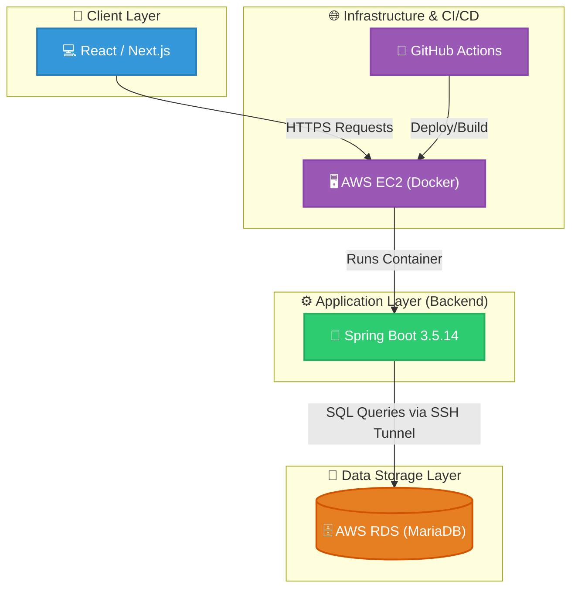

# CrowdFund

## 📝 프로젝트 개요
이 프로젝트는 Spring Boot와 MyBatis, MariaDB를 활용한 크라우드 펀딩 플랫폼 백엔드 시스템입니다. JWT 기반의 인증/인가 처리를 지원하며, Docker를 활용한 CI/CD 환경이 구축되어 있습니다.

## 🛠 기술 스택
- **Language**: Java 17
- **Framework**: Spring Boot 3.5.14
- **ORM/DB**: MyBatis, MariaDB
- **Security**: Spring Security, JWT (jjwt)
- **Tooling**: Gradle, Docker
- **API Documentation**: SpringDoc OpenAPI (Swagger)

## 시스템 아키텍처(System Architecture)

## 🚀 CI/CD 및 배포 방식
본 프로젝트는 효율적인 배포를 위해 GitHub Actions를 활용한 자동화된 CI/CD 파이프라인을 구축하였습니다.

- **배포 프로세스**: `master` 브랜치로의 Pull Request가 `merged` 되는 시점에 GitHub Actions가 자동으로 실행됩니다.
- **워크플로우**:
  1. 소스 코드 체크아웃 및 Java 17 환경 설정
  2. Docker 이미지 빌드 및 Docker Hub 푸시
  3. Amazon EC2 원격 접속 (SSH)
  4. 기존 컨테이너 중지/삭제 및 최신 이미지 Pull 후 컨테이너 실행
- **특징**: `Docker`를 사용하여 일관된 실행 환경을 보장하며, 환경 변수(`DB_URL`, `JWT_SECRET_KEY` 등)는 GitHub Secrets로 안전하게 관리합니다.

## 📂 프로젝트 구조
주요 패키지 구조는 다음과 같습니다:
- `io.github.crowdfund.global`: 전역 설정 (Security, Exception 등)
- `io.github.crowdfund.feature`: 각 기능별 모듈 (project, reward 등)

## 💡 주요 기능
- 회원 인증 및 JWT 기반 인가 처리
- 프로젝트 생성 및 조회 기능
- 프로젝트 리워드 관리
- 관리자(Admin) 전용 API

## ERD

