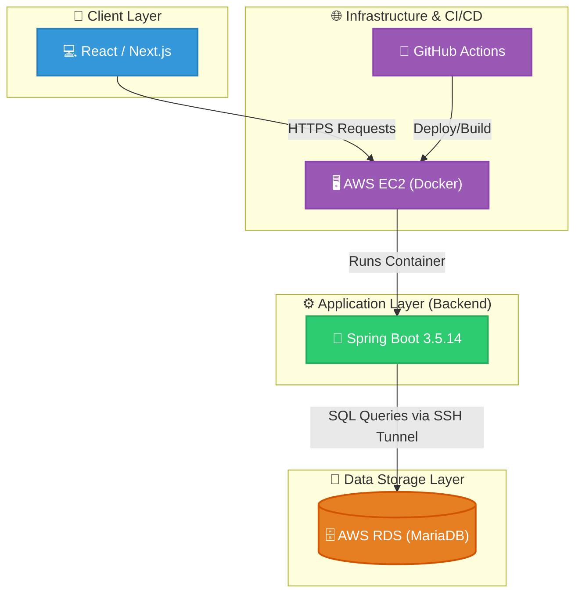

# CrowdFund — 복합 커서 기반 페이징과 모듈형 아키텍처를 적용한 크라우드 펀딩 RESTful API

- 2026.05.08 ~ 2026.06.15(1차 개발 완료)

## QR 코드 및 API Swagger 이미지

    

    
API Swagger 펼치기

    

## 시스템 아키텍처(System Architecture)

## ERD

## 📂 패키지 분리 전략

- `io.github.crowdfund.global`: 전역 설정 (Security, 전역 예외 핸들러, 공통 응답 DTO, 페이지네이션처럼 재사용되는 공통 코드)
- `io.github.crowdfund.domain`: Spring Data JDBC 엔티티, 도메인 인터페이스, MyBatis 도메인 매퍼
- `io.github.crowdfund.feature`: 각 기능별 서비스 로직 및 API 컨트롤러 모듈화

## 💡 핵심 구현 기술

### 1. 성능 최적화를 위한 복합 커서 기반 페이지네이션

> 도입 배경:
> - 프론트엔드에서 무한스크롤을 구현하고 싶은데, 기존 OFFSET / LIMIT 방식의 페이지네이션을 사용하면 동일 데이터에 대한 중복 요청이 발생해서 성능 문제가 생김
    
> 구현 방식:
> - 복합 커서 조건식: (created_at < :cursorCreatedAt OR (created_at = :cursorCreatedAt AND id < :cursorId))을 적용해 대용량 데이터에서도 일정한 조회 성능(O(1)) 및 데이터 정합성 보장
> - hasNext 계산 방식: Limit + 1 전략: 다음 페이지 존재 여부(hasNext)를 별도의 COUNT 쿼리 없이 판단하여 DB 부하 최소화
> - 공통 모듈화: 제네릭과 함수형 인터페이스(cursorExtractor)를 활용한 CursorPaginationProcessor로 복합 커서 주체를 주입해서 재사용 할 수 있게 별도 모듈로 분리

### 2. Spring Data JDBC & MyBatis 혼용 도입

> 도입 배경:
> - JPA와 MyBatis 혼용 설계를 구현해보고 싶었지만, 프로젝트 일정 내에 높은 학습 비용과 복잡한 영속성 컨텍스트 관리가 요구되는 JPA를 도입하기는 어려울 것이라고 판단이 들었음. 그래서 배우기 쉽고 향후 JPA로 마이그레이션이 용이한 Spring Data JDBC를 징검다리 기술로 채택함
    
> 도입 효과: 
> - 개발 생산성 극대화: 단순 반복적인 CRUD 및 단건 조회는 Spring Data JDBC의 메서드 이름 기반 쿼리로 빠르게 쳐내고, 복잡한 통계나 다중 조인(Join)이 필요한 핵심 비즈니스 로직에만 MyBatis를 사용하여 전체적인 개발 기간을 단축했습니다.
> - 안정적인 데이터 관리: Spring Data JDBC는 JPA와 달리 영속성 컨텍스트가 없어, MyBatis와 동일한 데이터베이스 세션 및 트랜잭션 범위 내에서 예기치 못한 데이터 정합성 오류나 동기화 문제없이 안정적으로 트랜잭션을 제어할 수 있었습니다.
> - 성장 지향적 아키텍처 구축: 엔티티 중심의 도메인 설계와 리포지토리 패턴을 미리 적용해 둠으로써, 향후 학습 숙련도에 따라 JPA(Spring Data JPA)로 매끄럽게 마이그레이션할 수 있는 기술적 발판을 마련했습니다.

### 3. 무상태(Stateless) JWT 기반 인증/인가 및 세분화된 리소스 권한 제어

> 도입 배경:
> - RESTful API 서버의 확장성을 위해 세션 클러스터링 의존 없이 무상태(Stateless) 아키텍처를 유지하면서, 사용자/창작자/관리자 간의 명확한 인가(Authorization) 처리가 필요함.

> 구현 방식:
> - Spring Security + JWT 필터 체인: JwtAuthenticationFilter를 커스텀 구현하여 Access Token 검증 및 SecurityContext 주입
> - 도메인 레벨 소유권 검증 (Ownership Validation): URL Path 파라미터 변조(IDOR 공격)를 방지하기 위해 SecurityUser.isOwner()를 통해 본인의 후원/프로젝트만 조회/취소/수정 가능하도록 서비스 계층에서 2차 인가 검증 수행
> - 예외 핸들링 표준화: JwtAuthenticationEntryPoint, JwtAccessDeniedHandler를 통해 401/403 에러 응답 규격을 통일

> 도입 효과:
> - 서버 수평 확장(Scale-out) 시 세션 동기화 문제 제거 및 안전한 사용자 리소스 격리 보장
> - CD 구현 방식: GitHub Actions과 Docker Hub Repository 사용

### 4. 공통 응답 구조 모듈화

> 도입 배경:
> - 엔드포인트마다 응답 포맷이 제각각이거나, 중복 선언되어서 프론트엔드에서 일관된 데이터 파싱 로직을 작성하기 어려운 문제가 발생함

> 구현 방식:
> - Record를 사용해서 응답 DTO 객체를 정의하고 정적 팩토리 메서드(success(), error())를 선언하여 객체 생성 로직도 함께 다루도록 함
> - @JsonInclude(NON_NULL)를 사용하여 응답 데이터에 null이 포함되지 않게 함

> 도입 효과:
> - 모든 API 응답이 일관된 규격(message, data 형태)을 갖추게 되어 프론트엔드의 API 응답 처리 로직이 단순화됨
> - 불필요한 null 필드 전송을 방지하여 불필요한 데이터가 전송되지 않음

### 5. 글로벌 예외 처리

> 도입 배경:
> - 서비스 계층에 try-catch로 예외를 처리하는 로직을 작성하면 비즈니스 로직과 예외 처리 로직이 뒤섞여 가독성이 떨어지고, 코드의 실행 흐름을 알기 힘들어지는 문제가 발생함

> 구현 방식:
> - RestControllerAdvice 어노테이션을 사용하여 Spring Security Filter Chain에 의해 호출되는 에러 핸들러 클래스를 정의함.
> - 해당 에러 핸들러 클래스 내부에 RequestParam, RequestBody와 IllegalArgumentException 에러 발생 시 호출되는 메서드를 선언함.

> 도입 효과:
> - RequestParam, RequestBody 검증 로직을 DTO의 Bean Validation 어노테이션과 전역 핸들러에 위임하여, 컨트롤러와 서비스 계층의 중복 검증 코드를 제거하고 관심사를 명확히 분리함
> - 서비스 계층에서는 비즈니스 예외 발생 시 try catch문을 선언하는 대신에 IllegalArgumentException을 thorw하는 것으로 클라이언트에 일관된 에러 메시지를 간편하게 전달할 수 있어 생산성과 가독성이 향상됨
> - 모든 예외 상황이 표준화된 ApiResult 에러 규격으로 일괄 반환되어 프론트엔드와의 협업 및 클라이언트 측 에러 핸들링 편의성이 극대화됨

